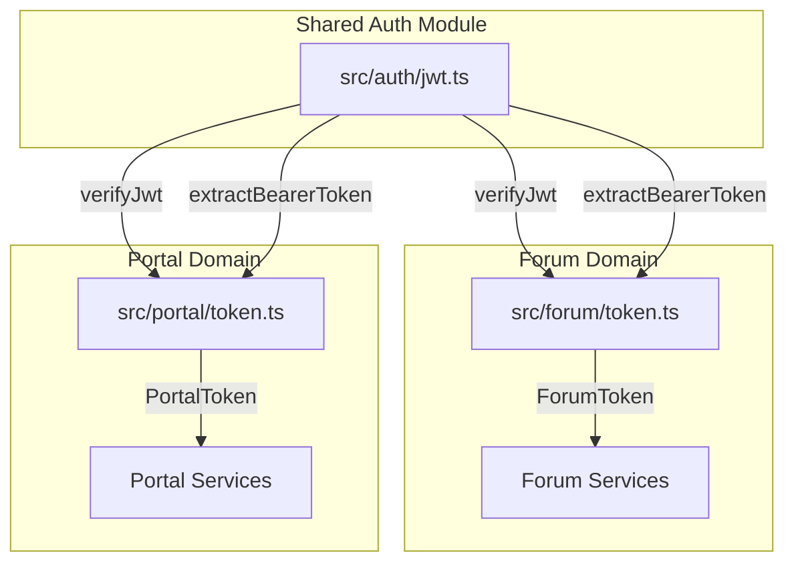

# Plan: Part 3 - Portal Authorization (1)

## Overview

The portal services will use Bearer tokens in the Authorization header, signed by the same key as the forum. The current JWT verification logic in [`src/forum/token.ts`](src/forum/token.ts) needs to be extracted into a shared module so both forum and portal can use the same signature verification while maintaining their own payload schemas.

## Current State

The forum module currently handles JWS token extraction and verification in [`src/forum/token.ts`](src/forum/token.ts):

```26:51:src/forum/token.ts
export async function parseToken(token: string, publicKeyPem?: string): Promise<ForumToken> {
  if (!publicKeyPem) throw new ServerError('no backend public key found to verify the token');
  const publicKey = await importSPKI(publicKeyPem, 'ES256');
  const { payload } = await jwtVerify(token, publicKey).catch(
    err => {
      throw new AuthenticationError(`JWT verification failed: ${(err as Error).message}`);
    }
  );
  const decodedPayload = jwsPayloadSchema.parse(payload);
  return {
    participantId: decodedPayload.participant_id,
    itemId: decodedPayload.item_id,
    userId: decodedPayload.user_id,
    isMine: decodedPayload.is_mine,
    canWatch: decodedPayload.can_watch,
    canWrite: decodedPayload.can_write,
  };
}

export async function extractTokenFromHttp(headers: Request['headers']): Promise<ForumToken> {
  const token = headers['authorization'];
  if (!token) throw new AuthenticationError('no Authorization header found in the headers.');
  if (!token.startsWith('Bearer ')) throw new AuthenticationError('the Authorization header is not a Bearer token');
  const jws = token.slice(7);
  return parseToken(jws, process.env.BACKEND_PUBLIC_KEY);
}
```

This mixes:

- **Generic concerns**: JWT signature verification, Bearer token extraction
- **Domain-specific concerns**: Forum payload schema validation and transformation

## Architecture Changes

Create a new shared authentication module that separates generic JWT operations from domain-specific payload handling:



## Implementation Steps

### 1. Create Shared JWT Module

Create new file [`src/auth/jwt.ts`](src/auth/jwt.ts) with:

**Core JWT verification function:**

```typescript
export async function verifyJwt(token: string, publicKeyPem?: string): Promise<JWTPayload>
```

- Takes raw JWT token and public key PEM
- Imports the public key using `importSPKI`
- Verifies signature using `jwtVerify` from jose library
- Returns the raw payload (unvalidated)
- Throws `ServerError` if no public key provided
- Throws `AuthenticationError` for verification failures

**Bearer token extraction:**

```typescript
export function extractBearerToken(authHeader?: string): string
```

- Extracts JWT from "Bearer {token}" format
- Throws `AuthenticationError` if header missing or malformed
- Returns the raw JWT string

**Token extraction from HTTP headers:**

```typescript
export async function extractAndVerifyFromHttp(headers: Record<string, string | undefined>): Promise<JWTPayload>
```

- Convenience function combining extraction and verification
- Uses `BACKEND_PUBLIC_KEY` environment variable
- Returns raw verified payload

### 2. Update Forum Token Module

Refactor [`src/forum/token.ts`](src/forum/token.ts) to use shared JWT module:

**Remove duplicate logic:**

- Remove low-level JWT verification code
- Remove Bearer token extraction logic
- Import shared functions from `src/auth/jwt.ts`

**Keep domain-specific logic:**

- Keep `jwsPayloadSchema` (forum-specific Zod schema)
- Keep `ForumToken` interface
- Keep `parseToken` function but simplify it to:

  1. Call `verifyJwt` from shared module
  2. Validate payload with `jwsPayloadSchema`
  3. Transform to `ForumToken` interface

- Keep `extractTokenFromHttp` and `extractTokenFromWs` but use shared `verifyJwt`

**Updated structure:**

```typescript
import { verifyJwt, extractBearerToken } from '../auth/jwt';

// Keep forum-specific schema
const jwsPayloadSchema = z.object({ ... });

// Simplified parseToken
export async function parseToken(token: string, publicKeyPem?: string): Promise<ForumToken> {
  const payload = await verifyJwt(token, publicKeyPem);
  const decodedPayload = jwsPayloadSchema.parse(payload);
  return { /* transform to ForumToken */ };
}

// Simplified extractTokenFromHttp
export async function extractTokenFromHttp(headers: Request['headers']): Promise<ForumToken> {
  const jws = extractBearerToken(headers['authorization']);
  return parseToken(jws, process.env.BACKEND_PUBLIC_KEY);
}
```

### 3. Create Tests for Shared Module

Create [`src/auth/jwt.spec.ts`](src/auth/jwt.spec.ts) with test cases:

**Test `verifyJwt` function:**

- Valid JWT with correct signature → returns payload
- JWT with wrong signature → throws `AuthenticationError`
- Invalid JWT format → throws `AuthenticationError`
- Expired JWT → throws `AuthenticationError`
- Missing public key → throws `ServerError`

**Test `extractBearerToken` function:**

- Valid "Bearer {token}" → returns token
- Missing header → throws `AuthenticationError`
- Malformed header (no "Bearer ") → throws `AuthenticationError`
- Empty token after "Bearer " → throws `AuthenticationError`

**Test `extractAndVerifyFromHttp` function:**

- Valid authorization header with valid JWT → returns payload
- Missing authorization header → throws error
- Invalid JWT in header → throws error

### 4. Update Existing Tests

**Forum token tests ([`src/forum/spec/token.test.ts`](src/forum/spec/token.test.ts)):**

- Verify all existing tests still pass
- No functional changes needed (internal refactoring only)

**Forum service tests:**

- Run tests for messages and thread-subscription services
- Ensure token extraction still works correctly

**E2E tests:**

- Run forum e2e tests to verify end-to-end token flow

### 5. Update Test Utilities

**Review [`src/testutils/token-generator.ts`](src/testutils/token-generator.ts):**

- No changes needed (generates forum-specific tokens)
- Future: May need portal token generator (Part 5)

## Files to Create

- [`src/auth/jwt.ts`](src/auth/jwt.ts) - Shared JWT verification module
- [`src/auth/jwt.spec.ts`](src/auth/jwt.spec.ts) - Tests for shared JWT module

## Files to Modify

- [`src/forum/token.ts`](src/forum/token.ts) - Refactor to use shared JWT module
- No test files need modification (behavior unchanged)

## Key Design Decisions

### 1. Separation of Concerns

**Generic JWT operations** (shared):

- Signature verification
- Bearer token extraction
- Public key import
- Error handling for JWT verification

**Domain-specific operations** (forum/portal):

- Payload schema validation (Zod)
- Payload transformation (snake_case → camelCase)
- Domain-specific error messages
- Business logic based on token content

### 2. Function Organization

The shared module provides three levels of abstraction:

1. **`verifyJwt`**: Low-level JWT verification (signature only)
2. **`extractBearerToken`**: HTTP header parsing
3. **`extractAndVerifyFromHttp`**: Convenience combining 1 & 2

This allows both forum and portal to:

- Use high-level convenience functions for simple cases
- Use low-level functions for custom flows (e.g., WebSocket tokens)

### 3. Error Handling

Keep consistent error types:

- `ServerError`: Configuration issues (missing public key)
- `AuthenticationError`: Client errors (invalid token, missing header)

Both forum and portal should handle these consistently.

### 4. Backward Compatibility

This is a pure refactoring:

- All forum functionality remains unchanged
- All existing tests should pass without modification
- External API unchanged (same routes, same behavior)

### 5. Future Portal Integration

The portal token module will follow the same pattern:

```typescript
// src/portal/token.ts (future, Part 5)
import { verifyJwt, extractBearerToken } from '../auth/jwt';

const portalPayloadSchema = z.object({
  item_id: z.string(),
  user_id: z.string(),
  firstname: z.string(),
  lastname: z.string(),
  email: z.string(),
});

export async function parseToken(token: string, publicKeyPem?: string): Promise<PortalToken> {
  const payload = await verifyJwt(token, publicKeyPem);
  const validated = portalPayloadSchema.parse(payload);
  return { /* transform to PortalToken */ };
}
```

## Testing Strategy

### Unit Tests

1. Test shared JWT module independently
2. Test forum token module with mocked JWT functions
3. Verify error handling at each layer

### Integration Tests

1. Run all existing forum service tests
2. Run all existing forum e2e tests
3. Confirm no regressions

### Manual Testing

Not required (pure refactoring with comprehensive test coverage)

## Success Criteria

- [ ] New `src/auth/jwt.ts` module created with JWT verification functions
- [ ] Forum token module refactored to use shared module
- [ ] All existing tests pass without modification
- [ ] New tests for shared JWT module cover all scenarios
- [ ] No functional changes to forum services
- [ ] Code is ready for portal token implementation in Part 5

## Next Steps (Future Parts)

- **Part 4**: Add `NO_SIG_CHECK` environment variable support
- **Part 5**: Create portal token module with portal-specific payload
- **Part 6**: Integrate portal token with entry-state service