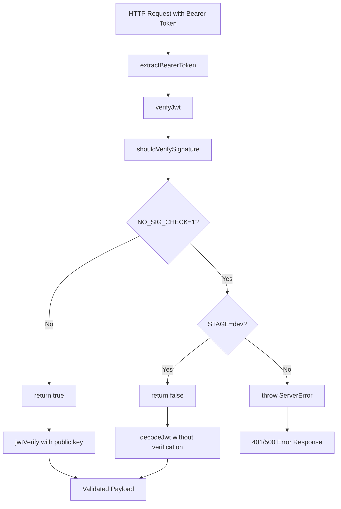

# Plan: Part 4 - Portal Authorization (2)

## Overview

Add support for a `NO_SIG_CHECK` environment variable that allows skipping JWT signature verification during development. The configuration is validated lazily (only when verifying tokens), and the feature is restricted to dev environment only.

## Requirements from Feature Document

From [`251217-portal.md`](/.cursor/features/251217-portal.md):

> If a given arg arg is given as env variable (something like NO_SIG_CHECK=1) (passed in serverless.yml), the signature is not checked when receiving a JWS.

>

> NO_SIG_CHECK=1 can only be set when env is "dev", otherwise, we get a failure.

## Implementation Approach

**Keep it simple with lazy validation:**

- Single helper function `shouldVerifySignature()` in [`src/auth/jwt.ts`](src/auth/jwt.ts)
- Checks configuration only when `verifyJwt()` is called
- Throws error immediately if `NO_SIG_CHECK=1` in non-dev environment
- No startup validation, no separate modules

## Detailed Implementation

### Step 1: Update JWT Module

Modify [`src/auth/jwt.ts`](src/auth/jwt.ts):

**Add new import:**

```typescript
import { importSPKI, jwtVerify, decodeJwt, JWTPayload } from 'jose';
```

**Add helper function:**

```typescript
/**
 * Determine if JWT signature verification should be performed
 * @returns true if signature should be verified, false to skip verification
 * @throws ServerError if NO_SIG_CHECK=1 in non-dev environment
 */
function shouldVerifySignature(): boolean {
  const noSigCheck = process.env.NO_SIG_CHECK === '1';
  
  if (!noSigCheck) {
    return true; // Normal verification
  }
  
  // NO_SIG_CHECK=1 is set, validate it's only in dev
  const stage = process.env.STAGE || 'dev';
  if (stage !== 'dev') {
    throw new ServerError(
      `NO_SIG_CHECK=1 can only be used in dev environment. Current stage: ${stage}`
    );
  }
  
  return false; // Skip verification in dev
}
```

**Update verifyJwt function:**

```typescript
export async function verifyJwt(token: string, publicKeyPem?: string): Promise<JWTPayload> {
  // Check if we should skip signature verification
  if (!shouldVerifySignature()) {
    // Decode without verification (dev mode only)
    return decodeJwt(token);
  }
  
  // Normal verification flow (unchanged)
  if (!publicKeyPem) {
    throw new ServerError('no backend public key found to verify the token');
  }

  const publicKey = await importSPKI(publicKeyPem, 'ES256');
  const { payload } = await jwtVerify(token, publicKey).catch(
    err => {
      throw new AuthenticationError(`JWT verification failed: ${(err as Error).message}`);
    }
  );

  return payload;
}
```

**Complete updated file structure:**

1. Import `decodeJwt` from jose
2. Add `shouldVerifySignature()` helper (private function)
3. Update `verifyJwt()` to call helper at the start
4. Keep `extractBearerToken()` unchanged

### Step 2: Update serverless.yml

Add `NO_SIG_CHECK` to environment variables in [`serverless.yml`](serverless.yml):

```yaml
provider:
  name: aws
  environment:
    STAGE: ${opt:stage, 'dev'}
    NO_SIG_CHECK: ${env:NO_SIG_CHECK, '0'}
    BACKEND_PUBLIC_KEY: ${env:BACKEND_PUBLIC_KEY}
    TABLE_NAME: ${env:TABLE_NAME}
    APIGW_ENDPOINT: ${env:APIGW_ENDPOINT}
```

**Note:** Defaults to '0' if not set in environment.

### Step 3: Add Comprehensive Tests

Update [`src/auth/jwt.spec.ts`](src/auth/jwt.spec.ts) with new test scenarios:

**Test structure:**

```typescript
describe('verifyJwt with NO_SIG_CHECK', () => {
  const originalNoSigCheck = process.env.NO_SIG_CHECK;
  const originalStage = process.env.STAGE;

  afterEach(() => {
    process.env.NO_SIG_CHECK = originalNoSigCheck;
    process.env.STAGE = originalStage;
  });

  describe('when NO_SIG_CHECK=1 and STAGE=dev', () => {
    // Test 1: Valid token decodes without verification
    // Test 2: Token with invalid signature still decodes
    // Test 3: Expired token still decodes (no expiry check)
    // Test 4: Malformed token throws error
  });

  describe('when NO_SIG_CHECK=1 and STAGE=prod', () => {
    // Test 1: Throws ServerError about misconfiguration
  });

  describe('when NO_SIG_CHECK=1 and STAGE=test', () => {
    // Test 1: Throws ServerError about misconfiguration
  });

  describe('when NO_SIG_CHECK=0 or not set', () => {
    // Test 1: Normal verification works (existing tests)
  });
});
```

**Key test scenarios:**

1. **NO_SIG_CHECK=1, STAGE=dev:**

                                                - ✅ Valid token → decodes successfully
                                                - ✅ Invalid signature → still decodes (signature not checked)
                                                - ✅ Expired token → decodes (expiry not checked)
                                                - ❌ Malformed JWT → throws error (cannot decode)

2. **NO_SIG_CHECK=1, STAGE=prod:**

                                                - ❌ Any token → throws ServerError("NO_SIG_CHECK=1 can only be used in dev environment. Current stage: prod")

3. **NO_SIG_CHECK=1, STAGE=test:**

                                                - ❌ Any token → throws ServerError("NO_SIG_CHECK=1 can only be used in dev environment. Current stage: test")

4. **NO_SIG_CHECK=0 or undefined:**

                                                - Normal verification (all existing tests pass)

## Architecture Diagram



## Files to Modify

- [`src/auth/jwt.ts`](src/auth/jwt.ts) - Add shouldVerifySignature helper and update verifyJwt
- [`src/auth/jwt.spec.ts`](src/auth/jwt.spec.ts) - Add comprehensive tests for NO_SIG_CHECK scenarios
- [`serverless.yml`](serverless.yml) - Add NO_SIG_CHECK environment variable

## No Startup Validation

**Important:** There is NO validation at application startup. The configuration is checked lazily when `verifyJwt()` is called. This means:

- ✅ No changes to [`src/handlers.ts`](src/handlers.ts)
- ✅ No separate validation module
- ✅ Error happens on first token verification attempt if misconfigured
- ✅ Simpler implementation

## Security Considerations

### Why This is Safe

1. **Lazy Validation**: Error thrown on first token verification if misconfigured
2. **Explicit Opt-In**: Requires `NO_SIG_CHECK=1` explicitly set
3. **Stage Check**: Only works when `STAGE=dev`
4. **Immediate Failure**: First auth attempt fails if used in wrong environment

### Use Cases

**Valid:**

- Local development without backend public key
- Testing with mock tokens
- Simplified dev environment

**Prevented:**

- Production use (fails on first auth)
- Staging use (fails on first auth)
- Test environment use (fails on first auth)

## Configuration Examples

### Development (.env)

```bash
STAGE=dev
NO_SIG_CHECK=1
BACKEND_PUBLIC_KEY=  # Can be empty
```

### Production

```bash
STAGE=prod
# NO_SIG_CHECK not set (defaults to 0)
BACKEND_PUBLIC_KEY=<actual-key>
```

### Tests (jest.setup.ts)

```typescript
process.env.STAGE = 'test';
// NO_SIG_CHECK not set (defaults to 0)
```

## Testing Strategy

### Unit Tests

- Test shouldVerifySignature logic with all stage combinations
- Test decoding without verification in dev
- Test error thrown in non-dev stages
- Verify existing tests still pass

### Integration Tests

- All existing forum tests pass (NO_SIG_CHECK defaults to 0)
- Manual testing with NO_SIG_CHECK=1 in dev

### Manual Testing

1. Set NO_SIG_CHECK=1, STAGE=dev in .env
2. Test forum services with any JWT (including invalid signatures)
3. Verify tokens are accepted without verification
4. Change STAGE=prod and verify error is thrown

## Success Criteria

- [ ] `shouldVerifySignature()` helper function added to jwt.ts
- [ ] `verifyJwt()` uses shouldVerifySignature before verification
- [ ] Import `decodeJwt` from jose library
- [ ] NO_SIG_CHECK environment variable added to serverless.yml
- [ ] Comprehensive tests added for all scenarios
- [ ] All 200 existing tests still pass
- [ ] Error thrown when NO_SIG_CHECK=1 used in non-dev environment
- [ ] No changes to handlers.ts or any other files

## Implementation Notes

**Order of implementation:**

1. Update jwt.ts (add helper, update verifyJwt, add import)
2. Add tests to jwt.spec.ts
3. Update serverless.yml
4. Run all tests to verify

**Key principle:**

- Everything is self-contained in the JWT module
- Validation happens when needed, not at startup
- Simple, clear, maintainable