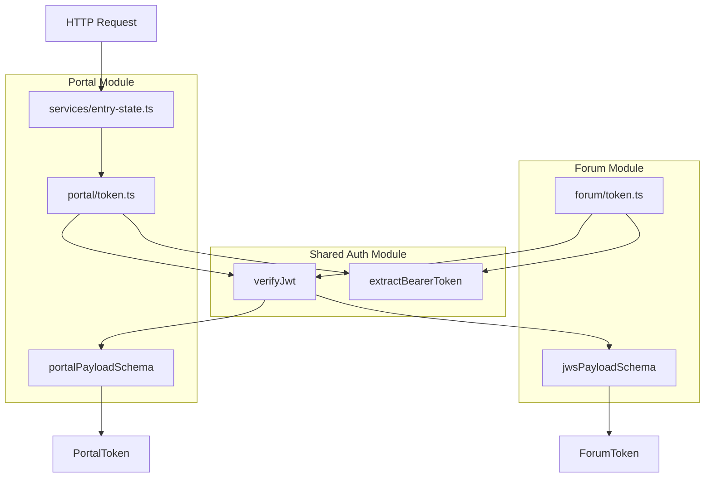

# Plan: Part 5 - Portal Authorization (3)

## Overview

Create a portal-specific token module following the same pattern as the forum token module, but with a different payload schema. Integrate token authentication into the existing entry-state service to require authentication.

## Requirements from Feature Document

From [`251217-portal.md`](/.cursor/features/251217-portal.md):

> The token for the portal part will currently contain the item_id (string), the user_id (string), the firstname, lastname and email (strings).

>

> Check this token in the entry state service.

## Portal Token Payload

Portal tokens will have a different structure than forum tokens:

**Portal token payload:**

- `item_id` (string) - The item being accessed
- `user_id` (string) - The user making the request
- `firstname` (string) - User's first name
- `lastname` (string) - User's last name
- `email` (string) - User's email address

**Forum token payload (for comparison):**

- `item_id`, `participant_id`, `user_id` (strings)
- `is_mine`, `can_watch`, `can_write` (booleans)

## Implementation Approach

Follow the same pattern as [`src/forum/token.ts`](src/forum/token.ts):

1. Create portal token module with Zod schema validation
2. Use shared JWT functions from [`src/auth/jwt.ts`](src/auth/jwt.ts)
3. Create token extraction functions for HTTP requests
4. Add comprehensive tests
5. Update entry-state service to require authentication

## Detailed Implementation

### Step 1: Create Portal Token Module

Create new file [`src/portal/token.ts`](src/portal/token.ts):

```typescript
import { AuthenticationError } from '../utils/errors';
import { Request } from 'lambda-api';
import * as z from 'zod';
import { verifyJwt, extractBearerToken } from '../auth/jwt';

const portalPayloadSchema = z.object({
  item_id: z.string(),
  user_id: z.string(),
  firstname: z.string(),
  lastname: z.string(),
  email: z.string(),
});

export interface PortalToken {
  itemId: string;
  userId: string;
  firstname: string;
  lastname: string;
  email: string;
}

export async function parseToken(token: string, publicKeyPem?: string): Promise<PortalToken> {
  const payload = await verifyJwt(token, publicKeyPem);
  const decodedPayload = portalPayloadSchema.parse(payload);
  return {
    itemId: decodedPayload.item_id,
    userId: decodedPayload.user_id,
    firstname: decodedPayload.firstname,
    lastname: decodedPayload.lastname,
    email: decodedPayload.email,
  };
}

export async function extractTokenFromHttp(headers: Request['headers']): Promise<PortalToken> {
  const jws = extractBearerToken(headers['authorization']);
  return parseToken(jws, process.env.BACKEND_PUBLIC_KEY);
}
```

**Key points:**

- Zod schema validates portal-specific fields
- Transform snake_case to camelCase (except firstname, lastname, email)
- Uses shared `verifyJwt` and `extractBearerToken` from auth module
- No WebSocket support needed (portal is HTTP only)

### Step 2: Update Entry State Service

Modify [`src/portal/services/entry-state.ts`](src/portal/services/entry-state.ts):

```typescript
import { HandlerFunction } from 'lambda-api';
import { loadConfig } from '../../config';
import { extractTokenFromHttp } from '../token';

async function get(req: any): Promise<{ payment: { state: string } }> {
  // Extract and validate token
  const token = await extractTokenFromHttp(req.headers);
  
  // Token is now validated, can use token.itemId, token.userId, etc.
  const config = loadConfig();
  const paymentState = config.portal?.payment ? 'unpaid' : 'disabled';

  return {
    payment: {
      state: paymentState,
    },
  };
}

export const getEntryState: HandlerFunction = get;
```

**Changes:**

- Import `extractTokenFromHttp` from portal token module
- Make function `async`
- Call `extractTokenFromHttp(req.headers)` to validate token
- Token is now available for future use (Part 6 will use `token.userId`)

### Step 3: Create Portal Token Tests

Create new file [`src/portal/token.spec.ts`](src/portal/token.spec.ts):

**Test structure:**

```typescript
describe('Portal Token Module', () => {
  describe('parseToken', () => {
    // Valid token with all fields
    // Invalid signature
    // Invalid token format
    // Expired token
    // Missing required fields (firstname, lastname, email, etc.)
    // Missing public key
  });

  describe('extractTokenFromHttp', () => {
    // Valid authorization header with valid token
    // Invalid token in header
    // Missing authorization header
    // Malformed authorization header
  });
});
```

**Key test scenarios:**

1. Valid portal token → successfully parses
2. Token missing `firstname` → throws validation error
3. Token missing `email` → throws validation error
4. Token with wrong signature → throws AuthenticationError
5. Missing Authorization header → throws AuthenticationError

### Step 4: Create Portal Token Generator for Tests

Create new file [`src/testutils/portal-token-generator.ts`](src/testutils/portal-token-generator.ts):

```typescript
import { SignJWT } from 'jose';
import { PortalToken } from '../portal/token';

/**
 * Generate a signed portal JWT token
 */
export const generatePortalToken = async (
  payload: Partial<PortalToken> & { itemId: string, userId: string },
  privateKey: any
): Promise<string> => {
  const fullPayload = {
    item_id: payload.itemId,
    user_id: payload.userId,
    firstname: payload.firstname || 'John',
    lastname: payload.lastname || 'Doe',
    email: payload.email || 'john.doe@example.com',
  };

  return await new SignJWT(fullPayload)
    .setProtectedHeader({ alg: 'ES256' })
    .setExpirationTime('1h')
    .sign(privateKey);
};
```

### Step 5: Update Entry State Service Tests

Update [`src/portal/services/entry-state.spec.ts`](src/portal/services/entry-state.spec.ts):

**Add token generation and authentication tests:**

```typescript
import { generatePortalToken } from '../../testutils/portal-token-generator';
import { initializeKeys } from '../../testutils/token-generator';

describe('Entry State Service', () => {
  beforeAll(async () => {
    await initializeKeys();
  });

  describe('authentication', () => {
    it('should require valid authorization token', async () => {
      const token = await generatePortalToken({
        itemId: 'item123',
        userId: 'user456',
      });

      const req = {
        headers: { authorization: `Bearer ${token}` },
      };

      const result = await getEntryState(req);
      expect(result).toHaveProperty('payment');
    });

    it('should reject request without authorization header', async () => {
      const req = { headers: {} };
      
      await expect(getEntryState(req))
        .rejects.toThrow('no Authorization header found');
    });

    it('should reject request with invalid token', async () => {
      const req = {
        headers: { authorization: 'Bearer invalid-token' },
      };

      await expect(getEntryState(req))
        .rejects.toThrow();
    });
  });

  describe('payment state', () => {
    // Existing tests with authentication added
  });
});
```

### Step 6: Update E2E Tests

Update [`src/portal/e2e/entry-state.spec.ts`](src/portal/e2e/entry-state.spec.ts):

**Add authorization headers to all test requests:**

```typescript
import { generatePortalToken } from '../../testutils/portal-token-generator';
import { initializeKeys } from '../../testutils/token-generator';

describe('E2E: Portal Entry State', () => {
  beforeAll(async () => {
    await initializeKeys();
  });

  it('should return entry state with authorization', async () => {
    const token = await generatePortalToken({
      itemId: 'item123',
      userId: 'user456',
    });

    const event = mockALBEvent({
      path: '/sls/portal/entry-state',
      httpMethod: 'GET',
      headers: {
        authorization: `Bearer ${token}`,
      },
      body: null,
    });

    const result = await globalHandler(event, {} as any) as any;

    expect(result.statusCode).toBe(200);
    // ... rest of assertions
  });
});
```

## Architecture Diagram



## Files to Create

- [`src/portal/token.ts`](src/portal/token.ts) - Portal token module with validation
- [`src/portal/token.spec.ts`](src/portal/token.spec.ts) - Unit tests for portal token
- [`src/testutils/portal-token-generator.ts`](src/testutils/portal-token-generator.ts) - Test helper for generating portal tokens

## Files to Modify

- [`src/portal/services/entry-state.ts`](src/portal/services/entry-state.ts) - Add token authentication
- [`src/portal/services/entry-state.spec.ts`](src/portal/services/entry-state.spec.ts) - Add authentication tests
- [`src/portal/e2e/entry-state.spec.ts`](src/portal/e2e/entry-state.spec.ts) - Add authorization headers to all tests

## Key Design Decisions

### 1. Reuse Shared JWT Functions

Portal tokens use the same `verifyJwt` and `extractBearerToken` functions as forum tokens, ensuring:

- Consistent authentication behavior
- Automatic NO_SIG_CHECK support (from Part 4)
- Same error handling
- Less code duplication

### 2. Domain-Specific Validation

Each domain (forum vs portal) has its own:

- Zod schema for payload validation
- Token interface
- Token parsing logic

This allows different token structures while sharing verification logic.

### 3. Token Fields

Portal tokens do NOT transform all fields to camelCase:

- `item_id` → `itemId` ✓
- `user_id` → `userId` ✓
- `firstname` → `firstname` (no transformation)
- `lastname` → `lastname` (no transformation)
- `email` → `email` (no transformation)

This matches the requirement that they are "strings" without compound names.

### 4. No WebSocket Support

Portal services are HTTP-only, so no `extractTokenFromWs` function is needed.

### 5. Service Integration

The entry-state service now requires authentication but doesn't yet use the token data. Part 6 will use `token.userId` for Stripe customer lookup.

## Testing Strategy

### Unit Tests

- Test portal token parsing with all field combinations
- Test validation errors for missing/invalid fields
- Test token extraction from HTTP headers
- Test error handling for malformed tokens

### Service Tests

- Test entry-state service requires authentication
- Test with valid tokens
- Test rejection of invalid tokens
- Test rejection of missing authorization

### Integration Tests (E2E)

- Update all existing e2e tests to include authorization
- Test end-to-end authentication flow
- Verify existing functionality with authentication

## Success Criteria

- [ ] Portal token module created with proper validation
- [ ] Entry-state service requires authentication
- [ ] All portal token tests pass
- [ ] All entry-state tests updated and pass
- [ ] All e2e tests updated and pass
- [ ] No regressions in existing functionality
- [ ] All tests pass (should increase from 210 to ~230 tests)

## Future Considerations

**Part 6 will use the token:**

- `token.userId` for Stripe customer lookup
- `token.firstname` and `token.lastname` for customer name
- `token.email` for customer email
- `token.itemId` for invoice metadata

The token is extracted and validated in Part 5, ready to be used in Part 6.