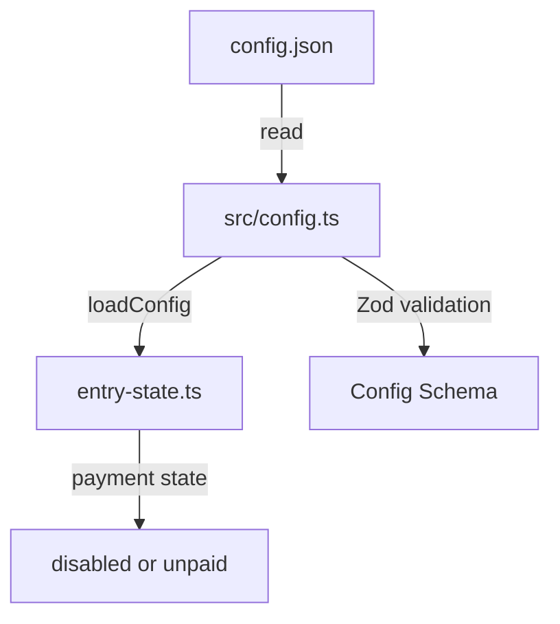

# Plan: Part 2 - Portal Basic Config

## Overview

Add a configuration system for the portal that reads from a JSON file. The configuration will determine whether payment functionality is enabled or disabled. Update the entry-state service to return "disabled" or "unpaid" based on this configuration.

## Configuration Structure

Create a JSON configuration file with the following structure:

```json
{
  "portal": {
    "payment": {
      "stripe": {
        "sk": "stripe_secret_key_here"
      }
    }
  }
}
```

Key behaviors:

- If `portal.payment` is not present or undefined → payment is "disabled"
- If `portal.payment` is present → payment is "unpaid" (will become "paid" after Stripe integration in Part 6)

## Implementation Steps

### 1. Create Configuration File

Create [`config.json`](config.json) at the project root:

- Start with an empty portal config `{"portal": {}}`
- This file will be manually edited to enable/disable payment
- Add to `.gitignore` to prevent committing sensitive keys (optional, but recommended)

### 2. Create Config Module

Create [`src/config.ts`](src/config.ts):

- Define config schema using Zod for type safety:
  - `PortalPaymentConfig` with optional `stripe.sk`
  - `Config` with optional `portal.payment`
- Implement `loadConfig()` function:
  - Read `config.json` from project root
  - Parse and validate using Zod schema
  - Return typed config object
  - Handle missing file gracefully (return empty config)
- Export typed interfaces and loader function

Example structure:

```typescript
interface PortalPaymentConfig {
  stripe: {
    sk: string;
  };
}

interface Config {
  portal?: {
    payment?: PortalPaymentConfig;
  };
}

export function loadConfig(): Config
```

### 3. Update Entry State Service

Modify [`src/portal/services/entry-state.ts`](src/portal/services/entry-state.ts):

- Import `loadConfig` from config module
- Read config at runtime
- Return payment state based on config:
  - `"disabled"` if `config.portal?.payment` is undefined
  - `"unpaid"` if `config.portal?.payment` is defined

Updated response logic:

```typescript
const config = loadConfig();
const paymentState = config.portal?.payment ? 'unpaid' : 'disabled';
return { payment: { state: paymentState } };
```

### 4. Update Tests

Update [`src/portal/services/entry-state.spec.ts`](src/portal/services/entry-state.spec.ts):

- Mock the `loadConfig` function using Jest
- Test scenario 1: No payment config → returns "disabled"
- Test scenario 2: Payment config present → returns "unpaid"
- Remove or update existing test that hardcoded "unpaid"

Update [`src/portal/e2e/entry-state.spec.ts`](src/portal/e2e/entry-state.spec.ts):

- Test with different config scenarios
- May need to mock filesystem or config loading

Create [`src/config.spec.ts`](src/config.spec.ts):

- Test config loading from valid JSON
- Test handling of missing file
- Test validation of config structure
- Test invalid JSON handling

## Files to Create

- `config.json` - Configuration file (at project root)
- `src/config.ts` - Config loading module with Zod validation
- `src/config.spec.ts` - Config module tests

## Files to Modify

- `src/portal/services/entry-state.ts` - Use config to determine payment state
- `src/portal/services/entry-state.spec.ts` - Update tests for config-based behavior
- `src/portal/e2e/entry-state.spec.ts` - Update e2e tests
- `.gitignore` (optional) - Add `config.json` to prevent committing sensitive keys

## Architecture Diagram



## Key Design Decisions

1. **JSON File at Root**: Following the requirement "It can be in a basic file for now", placing `config.json` at project root for easy access and future migration to environment-based config.

2. **Runtime Config Loading**: Load config on each request rather than at startup. This allows config changes without redeployment (useful for development, can be optimized later).

3. **Graceful Degradation**: Missing config file defaults to empty config (payment disabled), avoiding service crashes.

4. **Type Safety**: Use Zod for runtime validation and TypeScript interfaces for compile-time type safety.

5. **Optional Payment Config**: The entire `portal.payment` object is optional, making it clear that payment is disabled by default.

6. **Config in .gitignore**: Since config will contain sensitive Stripe keys in the future, it should be added to `.gitignore` and documented separately.

## Future Considerations

- Part 3-5 will not need config changes (authentication is separate)
- Part 6 will use `config.portal.payment.stripe.sk` for Stripe API calls
- Later, this could be migrated to environment variables or AWS Secrets Manager