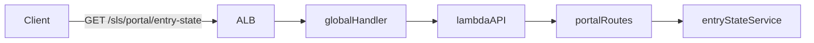

# Plan: Part 1 - Portal Initial Service

## Overview

Create a new "portal" subdomain mirroring the existing "forum" architecture, with a basic REST API endpoint at `GET /portal/entry-state` that returns payment state information.

## Architecture

Following the existing pattern established by the forum module:



## Implementation Steps

### 1. Create Portal Service Structure

Create [`src/portal/services/entry-state.ts`](src/portal/services/entry-state.ts):

- Implement `getEntryState` handler function
- Return hardcoded response with `payment.state = "unpaid"`
- Use `HandlerFunction` type from `lambda-api`
- No authentication required in Part 1 (will be added in Part 3-5)

Response format:

```json
{
  "payment": {
    "state": "unpaid"
  }
}
```

### 2. Create Portal Routes

Create [`src/portal/routes.ts`](src/portal/routes.ts):

- Export `portalRoutes` function that registers REST routes
- Register `GET /entry-state` → `getEntryState` handler
- Follow the same pattern as [`src/forum/routes.ts`](src/forum/routes.ts)

### 3. Register Portal in Global Handler

Update [`src/handlers.ts`](src/handlers.ts):

- Import `portalRoutes` from `./portal/routes`
- Register portal routes with prefix `/portal` (under the `sls` base path)
- Portal will be available at `/sls/portal/entry-state`

### 4. Add Tests

Create [`src/portal/services/entry-state.spec.ts`](src/portal/services/entry-state.spec.ts):

- Test that the endpoint returns correct structure
- Test that payment state is "unpaid"
- Mock the lambda-api Request/Response objects

## Files to Create

- `src/portal/services/entry-state.ts` - Service implementation
- `src/portal/routes.ts` - Route registration
- `src/portal/services/entry-state.spec.ts` - Unit tests

## Files to Modify

- `src/handlers.ts` - Register portal routes

## Key Design Decisions

1. **No Authentication Yet**: Part 1 implements the basic endpoint structure. Authentication with JWT tokens will be added in Part 3-5.

2. **Hardcoded State**: For Part 1, the payment state is always "unpaid". Part 2 will add configuration support, and Part 6 will integrate with Stripe.

3. **REST Only**: Part 1 only implements REST endpoints. WebSocket support is not needed for the portal feature.

4. **Consistent Naming**: Following the forum module's naming conventions (`portalRoutes`, service file structure).