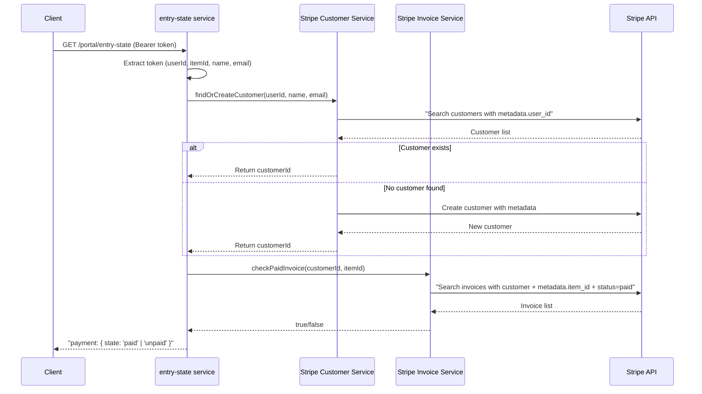

# Portal Part 6: Stripe as a Data Provider

## Overview

Integrate Stripe API to check payment status for items. The entry-state service will query Stripe to determine if a user has paid for a specific item, returning "paid" or "unpaid" accordingly.

## Stripe Integration Flow



## Implementation Structure

### 1. Add Stripe Dependency

Install the official Stripe Node.js SDK:

```bash
npm install stripe@latest
```

Also add TypeScript types if not included in the package.

### 2. Create Stripe Client Module

**File**: [`src/stripe.ts`](src/stripe.ts)

Similar to [`src/dynamodb.ts`](src/dynamodb.ts), create a module that:

- Initializes the Stripe client with the secret key from config
- Exports a configured Stripe instance
- Handles missing configuration gracefully (returns null if no config)
```typescript
import Stripe from 'stripe';
import { loadConfig } from './config';

export function getStripeClient(): Stripe | null {
  const config = loadConfig();
  const stripeKey = config.portal?.payment?.stripe?.sk;
  
  if (!stripeKey) {
    return null;
  }
  
  return new Stripe(stripeKey, {
    apiVersion: '2025-12-15.clover',
  });
}
```


### 3. Create Customer Management Service

**File**: [`src/portal/services/stripe-customer.ts`](src/portal/services/stripe-customer.ts)

This service handles finding or creating Stripe customers:

**Key functions**:

- `findOrCreateCustomer(userId: string, name: string, email: string): Promise<string>`
  - Search customers by `metadata.user_id`
  - If 0 results: Create customer with name, email, and metadata
  - If 1 result: Return customerId
  - If >1 results: `console.warn()` and return first customerId

**Implementation details**:

- Use Stripe SDK's `customers.search()` with query `metadata['user_id']:'${userId}'`
- Use `customers.create()` with:
  - `name`: `${firstname} ${lastname}`
  - `email`: from token
  - `metadata`: `{ user_id: userId }`
- Handle Stripe API errors with try-catch and wrap in custom error types

### 4. Create Invoice Checking Service

**File**: [`src/portal/services/stripe-invoice.ts`](src/portal/services/stripe-invoice.ts)

This service checks for paid invoices:

**Key functions**:

- `hasPaidInvoice(customerId: string, itemId: string): Promise<boolean>`
  - Search invoices with `customer` filter and `metadata.item_id`
  - Filter by `status: 'paid'`
  - If 0 results: return `false`
  - If >=1 results: return `true` (warn if >1 with `console.warn()`)

**Implementation details**:

- Use Stripe SDK's `invoices.search()` with query combining:
  - `customer:'${customerId}'`
  - `metadata['item_id']:'${itemId}'`
  - `status:'paid'`
- Note: Stripe search API may not support all metadata filters, might need to fetch and filter in code

### 5. Update Entry State Service

**File**: [`src/portal/services/entry-state.ts`](src/portal/services/entry-state.ts)

Update the existing service to use Stripe for payment determination:

**Current logic**:

```typescript
const paymentState = config.portal?.payment ? 'unpaid' : 'disabled';
```

**New logic**:

```typescript
const config = loadConfig();
const token = await extractTokenFromHttp(req.headers);

if (!config.portal?.payment) {
  return { payment: { state: 'disabled' } };
}

// Stripe integration
const stripe = getStripeClient();
if (!stripe) {
  return { payment: { state: 'disabled' } };
}

const customerId = await findOrCreateCustomer(
  stripe,
  token.userId,
  `${token.firstname} ${token.lastname}`,
  token.email
);

const isPaid = await hasPaidInvoice(stripe, customerId, token.itemId);
const paymentState = isPaid ? 'paid' : 'unpaid';

return { payment: { state: paymentState } };
```

**Key changes**:

- Extract token BEFORE checking config (already done, but use token data)
- Pass Stripe client to service functions
- Use customer and invoice services to determine payment status
- Keep "disabled" state when no config or no Stripe client

### 6. Update Config File

**File**: [`config.json`](config.json)

Add a placeholder/example Stripe key for sandbox testing:

```json
{
  "portal": {
    "payment": {
      "stripe": {
        "sk": "sk_test_YOUR_SANDBOX_SECRET_KEY_HERE"
      }
    }
  }
}
```

**Note**: This file should be git-ignored or documented that developers need to replace with their own sandbox key. The current `.gitignore` should be checked.

### 7. Testing Strategy

#### Unit Tests

**File**: [`src/portal/services/stripe-customer.spec.ts`](src/portal/services/stripe-customer.spec.ts)

- Mock Stripe SDK's `customers.search()` and `customers.create()`
- Test finding existing customer (1 result)
- Test creating new customer (0 results)
- Test warning on multiple customers (>1 results)
- Test error handling

**File**: [`src/portal/services/stripe-invoice.spec.ts`](src/portal/services/stripe-invoice.spec.ts)

- Mock Stripe SDK's `invoices.search()`
- Test returning true when paid invoice exists
- Test returning false when no paid invoice
- Test warning on multiple paid invoices
- Test filtering by status and metadata

**File**: Update [`src/portal/services/entry-state.spec.ts`](src/portal/services/entry-state.spec.ts)

- Add new test cases for "paid" state
- Mock the customer and invoice services
- Test the full flow: disabled → unpaid → paid
- Test Stripe API error handling

**File**: [`src/stripe.spec.ts`](src/stripe.spec.ts)

- Test getStripeClient returns client when config is valid
- Test getStripeClient returns null when config is missing
- Mock loadConfig to test various scenarios

#### E2E Tests (Optional)

**File**: [`src/portal/e2e/entry-state.spec.ts`](src/portal/e2e/entry-state.spec.ts)

- Update existing E2E tests to mock Stripe API calls
- Test complete request flow with Stripe integration
- Consider using Stripe test mode fixtures if available

### 8. Error Handling

Add proper error handling for Stripe API failures:

- Network errors: Return "unpaid" and log error
- Invalid API key: Return "disabled" and log error
- Rate limiting: Consider retry logic or return last known state
- Use custom error types from [`src/utils/errors.ts`](src/utils/errors.ts)

### 9. Architecture Updates

Update [`ARCHITECTURE.md`](ARCHITECTURE.md) to document:

- Stripe integration architecture
- Customer and invoice management flow
- Payment state determination logic
- Configuration requirements

## Key Design Decisions

### Stripe Client Initialization

- Use lazy initialization pattern (create client on first use)
- Return null if config is missing, allowing graceful degradation
- Don't cache the client globally to allow for config changes

### Customer Management

- Always search before creating to avoid duplicates
- Use metadata for linking users to Stripe customers
- Warn on duplicates but don't fail - pick first result

### Invoice Checking

- Only check for "paid" status, ignore other statuses
- Use metadata to link invoices to items
- Return boolean for simplicity in entry-state service

### Testing with Sandbox

- Developers need to provide their own Stripe sandbox key
- Document in README how to obtain and configure sandbox key
- Consider environment variable override in future (Part 6.5)

## Files to Create/Modify

### New Files

1. `src/stripe.ts` - Stripe client initialization
2. `src/stripe.spec.ts` - Stripe client tests
3. `src/portal/services/stripe-customer.ts` - Customer management
4. `src/portal/services/stripe-customer.spec.ts` - Customer tests
5. `src/portal/services/stripe-invoice.ts` - Invoice checking
6. `src/portal/services/stripe-invoice.spec.ts` - Invoice tests

### Modified Files

1. `src/portal/services/entry-state.ts` - Add Stripe integration
2. `src/portal/services/entry-state.spec.ts` - Add paid state tests
3. `config.json` - Add Stripe sandbox key placeholder
4. `package.json` - Add Stripe SDK dependency
5. `ARCHITECTURE.md` - Document Stripe integration

## Environment Variable Override (Future)

**Note**: The user mentioned supporting env var override for the Stripe key "but we can do that later". This would involve:

- Check `process.env.STRIPE_SECRET_KEY` first
- Fall back to `config.json` if env var not set
- Update config loading logic in `src/config.ts` or `src/stripe.ts`
- Document in README

This can be implemented in a follow-up task if needed.